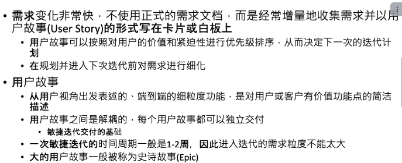

# 问题定义和软件需求

​​

## 软件需求的类型

功能性，质量，约束

​​

考察方式：给予一个需求，判断类别

​​

## 需求工程过程

获取，分析，描述，确认

​​

## 获取-需求分解与精化

在现有的**系统上下文**环境中建立并实现**愿景（需要实现用户的深层次意图）**

例子：电热水壶系统

​​

愿景分解和目标分解

and分解和or分解

​​

从what到how的转换

​​

## 优先级排序

基本-期望型-兴奋型

​​

## 冲突识别与协商

数据冲突，利益冲突，价值冲突

​​

## 场景分析与描述

• 场景（scenario）：参与者 （actor）与待开发系统之间的一系列交互步骤\
•参与者：待开发系统界之外的人（如图书管理员）、设备（如刷卡机）或其他系统（如在线支付系统）\
• 交互序列：有明确的开始和结束，构成一个相对完整的整体

• 用例（use case）：具有相同目标，交互过程相似（仅在部分步骤上有区别） 的一组场景\
•主场景：在大多数情况下会发生，且满足目标\
•可能场景：与主场景有所差异\
•异常处理场景：处理异常或失败情况

​​

考察方式：\
选择题判断是xx场景\
大题，分析一个软件，举例说出三种场景

参与者：人，外部设备，外部系统，定时器

目标系统通过交互接口和参与者交互，接口属于系统的一部分，除了定时器之外的参与者都在系统边界之外

如何识别典型的用例？\
​​

​​

给定一个系统，判断用例是否典型\
分析一个系统，给出典型用例

## uml用例图

​​

注意绘制系统边界\
实线是参与关系\
虚线是包含关系

## uml泳道图

开始是黑色的实心圆\
条件分支是棱形\
结束时黑色的带边框实心圆\
每一列是一个系统或者参与者

​​

## 用例的自然语言描述

​​

## 类分析与描述

专注于对象属性和相关关系

类之间存在多种不同类型的关系:继承(Inheritance)、聚合(Aggregation)、关联(Association)、依赖(Dependency)等

类的不同类型

​​

怎么识别分析我们需要的类：系统的**必要，多个**属性

​​

候选类的分析

​​

职责划分：完整覆盖和合理均衡

​​

确定协作关系:类的职责通过将自身能力(属性和操作)与其他类的协助相结合来实

## 类模型描述

​​

类：方框，上面是名字下面是包含的属性\
关联关系和继承关系-继承关系箭头指向父类

## 行为分析与描述

• 行为:系统或其一部分响应外部的事件激励而执行一些动作,同时伴随自身状态的变化\
• 行为分析:从系统本身了解其如何响应外部事件进行状态转换,并执行各种动作

基本概念\
• 状态:行为主体所处于的某种情形,一般会维持一段时间(短则几秒甚至更短,长则几小时甚至更长)\
• 事件:影响行为主体行为的外部或内部事件,推动行为主体状态的不断转换和各种动作的执行\
• 状态转换:行为主体各种状态之间的转换,一般是在事件的激励下发生的,有时也会附加相应的条件要求\
• 动作:维持某个状态期间或状态转换过程中执行的动作

## 行为分析的uml类图

​​

## 敏捷开发-用户故事

​

invest原则

​​.png>)

描述格式：角色-行动-商业价值

​​.png>)

与需求用例的区别

​​.png>)

将需求用例转换为用户故事

​​.png>)
